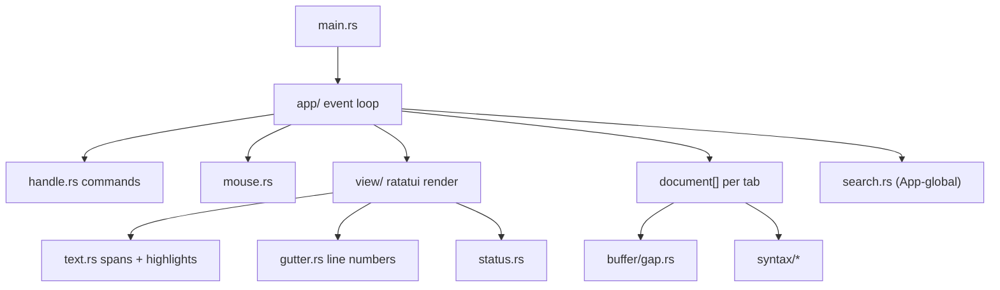
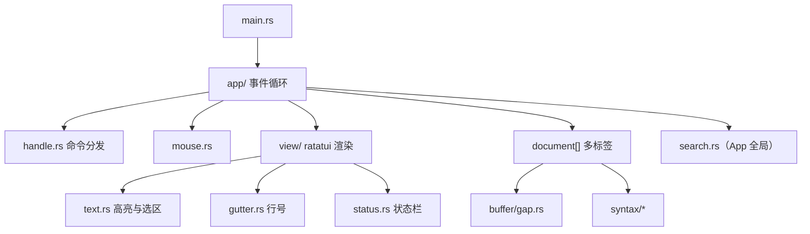

<p align="center">
  
  
  
  
</p>

<h1 align="center">termpad</h1>

<p align="center">
  <em>Lightweight · Terminal-native · Syntax-aware · Gap-buffered</em>
</p>

<p align="center">
  <strong>A Rust TUI text editor for the terminal</strong><br>
  gap buffer · ccpp_theme colors · find/replace · multi-tab<br>
  <br>
  <a href="#中文">中文</a> ·
  <a href="#quick-start">Quick Start</a> ·
  <a href="#keybindings">Keybindings</a> ·
  <a href="#architecture">Architecture</a> ·
  <a href="#references--comparison">References</a>
</p>

---

## Quick start

### Install (recommended — use `termpad` like `vim`)

**Windows (PowerShell):**

```powershell
.\scripts\install.ps1
termpad                         # empty buffer
termpad path\to\file.c          # open a file
```

**Linux / macOS:**

```bash
chmod +x scripts/install.sh
./scripts/install.sh
termpad README.md
```

This runs `cargo install` and puts `termpad` in `~/.cargo/bin` (Rust’s default; usually already on PATH).

### Develop / run from repo (no install)

From the project directory:

```powershell
.\termpad.cmd README.md          # Windows
```

```bash
chmod +x termpad
./termpad README.md              # Linux / macOS / Git Bash
```

Wrappers prefer `target/release/termpad`, then `target/debug/termpad`, else `cargo run`.

### Build & test

```powershell
cargo fmt                                     # format (see rustfmt.toml)
cargo fmt -- --check                          # CI-style format check
cargo clippy -- -D warnings                   # lint gate
cargo test                                    # 49 tests
.\scripts\check.ps1                           # fmt + clippy + test (Windows)
./scripts/check.sh                            # fmt + clippy + test (Linux/macOS)
cargo build --release
.\target\release\termpad.exe README.md        # Windows
./target/release/termpad README.md            # Linux / macOS
```

Requires a **UTF-8** terminal with true-color support for best syntax highlighting.

## Features

| Feature | Description |
| :-: | :-: |
| Gap Buffer | UTF-8 safe byte editing with cursor/selection |
| Syntax highlighting | **C / C++ / Rust / Markdown / Plain** (ccpp_theme palette) |
| Find / replace | Literal, regex (`Ctrl+R`), ignore case (`Ctrl+I`), replace all |
| Search highlights | Subtle background on all matches; orange on current match; syntax colors preserved |
| Multi-tab | `Ctrl+T` new tab, `Ctrl+Tab` switch; dirty-close confirmation |
| Selection | Shift+arrows or mouse drag; edit replaces selection |
| Status bar | Row/col, encoding, BOM, LF/CRLF, language, match count |
| Mouse | Click to move, drag to select, wheel to scroll |
| Large files | Full in-memory load; open/edit may feel slow on very large files |

## Keybindings

<details>
<summary>Normal mode</summary>

| Key | Action |
| :-: | :-: |
| `i` | Insert mode |
| `/` / `?` | Find forward / backward |
| `:` | Replace prompt |
| `n` / `N` | Next / previous match |
| `z` | Toggle fold at cursor |
| `w` | Close tab (confirm if dirty) |
| arrows / PageUp / PageDown | Move cursor |
| Shift + arrows | Extend selection |
| `Ctrl+S` | Save |
| `Ctrl+Q` | Quit (confirm if dirty) |
| `Ctrl+F` | Find |
| `Ctrl+G` | Goto line |
| `Ctrl+O` | Open path |
| `Ctrl+T` / `Ctrl+Tab` | New tab / next tab |
| `Ctrl+Shift+Tab` | Previous tab |
| `Ctrl+W` | Toggle whitespace display |
| `Ctrl+E` | Toggle LF / CRLF |
| `Alt+C` | Column insert mode |

</details>

<details>
<summary>Find mode</summary>

| Key | Action |
| :-: | :-: |
| type | Edit search query |
| `Enter` | Execute search |
| `Esc` | Cancel |
| arrows | Move cursor while editing query |
| `Ctrl+R` | Toggle regex |
| `Ctrl+I` | Toggle ignore case |

</details>

<details>
<summary>Replace mode</summary>

Run a search first (`/` or `Ctrl+F`), then `:` to enter the replacement string.

| Key | Action |
| :-: | :-: |
| type | Edit replacement text (Replace input) |
| `Enter` | Confirm replacement string → confirm prompt |
| `Esc` | Cancel (input or confirm step) |
| `y` / `Enter` | Replace current match (confirm step) |
| `a` | Replace all matches |
| `n` | Skip to next match |

</details>

## Architecture



<details>
<summary>Source tree</summary>

```
termpad/
├── Cargo.toml
├── README.md
├── LICENSE
├── docs/
│   └── architecture.md
├── demos/                   # syntax fixtures + Rust showcase
│   ├── demo.c / demo.cpp    # highlight regression (need not compile)
│   └── demo.rs              # idiomatic Rust demo + highlight test
├── src/
│   ├── main.rs
│   ├── app/                 # event loop, commands, mouse, prompts
│   ├── buffer/gap.rs        # gap buffer
│   ├── document.rs          # tab state, load/save
│   ├── search.rs            # find/replace
│   ├── syntax/              # C/C++/Rust/Markdown highlighters
│   ├── view/                # layout, gutter, text, status
│   └── theme.rs             # ccpp_theme palette
└── ...
```

</details>

Single-threaded design: no `Arc`/`Mutex`, no `unsafe`. Search and syntax spans use **byte** offsets within lines; cursor/selection use **character** columns — see `docs/architecture.md`.

**Known limitations** (for report / review): Gap Buffer read path is O(n); `Document` embeds `view::ViewState` (layer coupling). Details in [`docs/architecture.md`](docs/architecture.md#已知局限).

## References & comparison

| Reference | What we learned | How termpad differs |
| :-: | :-: | :-: |
| [Notepad--](https://github.com/cxasm/notepad--) | Feature checklist (find, tabs, status) | TUI instead of Qt; subset of languages; gap buffer in memory |
| [ccpp_theme](https://github.com/xenkuo/ccpp_theme) | Editor/search color palette | Ported to ratatui `Style` (find match backgrounds) |
| [kilo](https://github.com/antirez/kilo) | Minimal TUI editor structure | Multi-tab, regex search, richer syntax rules |
| [helix](https://github.com/helix-editor/helix) | TUI editing patterns | Single-thread MVP scope; no modal command system |

## License

This project is licensed under MIT — free and open.

---

<h1 id="中文" align="center">termpad</h1>

<p align="center">
  <em>轻量 · 终端原生 · 语法感知 · Gap Buffer</em>
</p>

<p align="center">
  <strong>Rust 终端文本编辑器（TUI）</strong><br>
  ccpp_theme 配色 · 查找/替换 · 多标签 · 鼠标滚轮<br>
  <br>
  <a href="#termpad">English</a>
</p>

---

## 快速开始

### 安装（推荐 — 像 `vim` 一样用 `termpad`）

**Windows（PowerShell）：**

```powershell
.\scripts\install.ps1
termpad                         # 空白缓冲区
termpad path\to\file.c          # 打开文件
```

**Linux / macOS：**

```bash
chmod +x scripts/install.sh
./scripts/install.sh
termpad README.md
```

会执行 `cargo install`，把 `termpad` 装到 `~/.cargo/bin`（Rust 默认目录，一般已在 PATH 里）。

### 不安装，直接在仓库里运行

在项目目录下：

```powershell
.\termpad.cmd README.md          # Windows
```

```bash
chmod +x termpad
./termpad README.md              # Linux / macOS / Git Bash
```

包装脚本优先用 `target/release/termpad`，其次 debug 版，否则回退到 `cargo run`。

### 编译与测试

```powershell
cargo fmt                                     # 格式化（见 rustfmt.toml）
cargo fmt -- --check                          # CI 风格格式检查
cargo clippy -- -D warnings                   # lint 门禁
cargo test                                    # 49 tests
.\scripts\check.ps1                           # fmt + clippy + test（Windows）
./scripts/check.sh                            # fmt + clippy + test（Linux/macOS）
cargo build --release
.\target\release\termpad.exe README.md        # Windows
./target/release/termpad README.md            # Linux / macOS
```

建议使用支持 **真彩色（true color）** 的 UTF-8 终端，语法高亮效果最佳。

## 功能特性

| 特性 | 说明 |
| :-: | :-: |
| Gap Buffer | UTF-8 安全字节编辑，光标/选区 |
| 语法高亮 | **C / C++ / Rust / Markdown / Plain**（ccpp_theme 配色） |
| 查找/替换 | 字面量、正则（`Ctrl+R`）、忽略大小写（`Ctrl+I`）、全部替换 |
| 搜索高亮 | 所有匹配浅灰底；当前匹配橙底；保留语法前景色 |
| 多标签 | `Ctrl+T` 新建，`Ctrl+Tab` 切换；未保存关闭需确认 |
| 选区 | Shift+方向键或鼠标拖拽；编辑时覆盖选区 |
| 状态栏 | 行/列、编码、BOM、换行符、语言、匹配数 |
| 鼠标 | 点击移动、拖拽选区、滚轮滚动 |
| 大文件 | 全量载入内存；打开或编辑超大文件时可能较慢 |

## 快捷键

<details>
<summary>Normal 模式</summary>

| 按键 | 功能 |
| :-: | :-: |
| `i` | 进入 Insert |
| `/` / `?` | 向前/向后查找 |
| `:` | 替换输入 |
| `n` / `N` | 下一个/上一个匹配 |
| `z` | 折叠/展开当前行 |
| `w` | 关闭标签（dirty 时确认） |
| 方向键 / PageUp / PageDown | 移动光标 |
| Shift + 方向键 | 扩展选区 |
| `Ctrl+S` | 保存 |
| `Ctrl+Q` | 退出（dirty 时确认） |
| `Ctrl+F` | 查找 |
| `Ctrl+G` | 跳转行号 |
| `Ctrl+O` | 打开路径 |
| `Ctrl+T` / `Ctrl+Tab` | 新标签 / 下一标签 |
| `Ctrl+Shift+Tab` | 上一标签 |
| `Ctrl+W` | 显示空白字符 |
| `Ctrl+E` | 切换 LF / CRLF |
| `Alt+C` | 列插入模式 |

</details>

<details>
<summary>Find 模式</summary>

| 按键 | 功能 |
| :-: | :-: |
| 输入 | 编辑搜索词 |
| `Enter` | 执行搜索 |
| `Esc` | 取消 |
| 方向键 | 编辑搜索词时移动光标 |
| `Ctrl+R` | 切换正则 |
| `Ctrl+I` | 切换忽略大小写 |

</details>

<details>
<summary>Replace 模式</summary>

先执行搜索（`/` 或 `Ctrl+F`），再按 `:` 输入替换内容。

| 按键 | 功能 |
| :-: | :-: |
| 输入 | 编辑替换串（Replace 输入态） |
| `Enter` | 确认替换串 → 进入确认提示 |
| `Esc` | 取消（输入或确认步骤） |
| `y` / `Enter` | 替换当前匹配（确认步骤） |
| `a` | 全部替换 |
| `n` | 跳过，下一个匹配 |

</details>

## 架构



单线程、无 `unsafe`。坐标约定与模块说明见 `docs/architecture.md`。

**已知局限**（报告可引用）：Gap Buffer 读路径 O(n)；`Document` 内嵌 `view::ViewState` 导致层间耦合。详见 [`docs/architecture.md#已知局限`](docs/architecture.md#已知局限)。

## 参考与对比

| 参考项目 | 借鉴内容 | 本项目差异 |
| :-: | :-: | :-: |
| [Notepad--](https://github.com/cxasm/notepad--) | 功能清单 | TUI 替代 Qt；语言子集；内存 Gap Buffer |
| [ccpp_theme](https://github.com/xenkuo/ccpp_theme) | 编辑器/搜索配色 | 移植到 ratatui，搜索匹配用底色高亮 |
| [kilo](https://github.com/antirez/kilo) | 极简 TUI 结构 | 多标签、正则搜索、更完整语法规则 |
| [helix](https://github.com/helix-editor/helix) | TUI 编辑模式 | MVP 范围；无复杂 modal 命令系统 |

## License

本项目使用 MIT 协议，开放自由。
